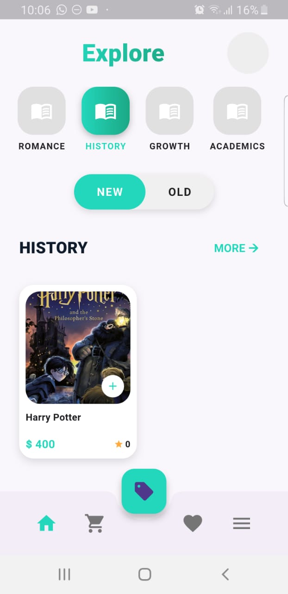
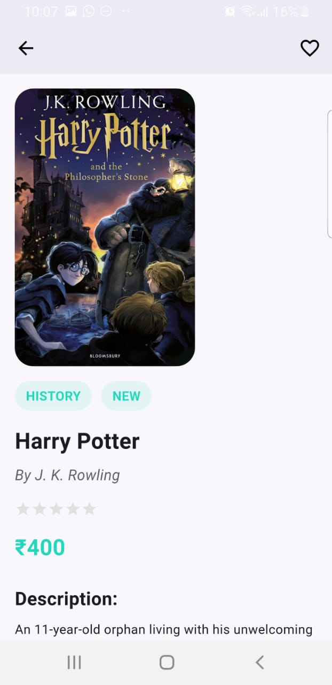

# 📚 Book Swap – Flutter Book Marketplace App

**Book Swap** is a full-featured mobile application built with **Flutter** and **Firebase**, enabling users to **buy, sell, and manage books** in a seamless, community-driven experience.

---

## 🚀 Features

- 🔐 **User Authentication** with Firebase (Email/Password)
- 📚 **Book Listings** with details page
- 🛒 **Cart Management** using Cloud Firestore
- 💬 **Contact Seller** via WhatsApp integration
- 📤 **Sell Your Book** with image upload to Firebase Storage
- 📥 **Email Notifications** to buyer & seller upon checkout
- ❤️ **View Liked Books**
- ⚙️ **Edit Profile** (Name, Address, Contact, Password)
- 👤 **About Me** page with books bought/sold info
- 🧭 Smooth navigation with Bottom Navigation Bar

---

## 🛠️ Tech Stack

- **Flutter** (Dart)
- **Firebase Authentication**
- **Cloud Firestore**
- **Firebase Storage**
- **WhatsApp API**

---

## 📷 Screenshots

```markdown


```

---

## 📦 Installation

### 1. Clone the Repository

```bash
git clone https://github.com/Qurat-ul-ainFatima/book_swap.git
cd book_swap

```
## 2. Install Flutter Dependencies

Make sure you have Flutter installed. Then install the required packages by running:

```bash
flutter pub get

```
## 3. Firebase Setup

Follow these steps to connect your Flutter app with Firebase:

1. Go to [Firebase Console](https://console.firebase.google.com/) and create a new project.
2. Inside your project, enable the following services:
   - 🔐 **Authentication** → Enable **Email/Password** sign-in method
   - 🗃️ **Cloud Firestore** → Set up Firestore Database
   - 🖼️ **Storage** → Enable Firebase Storage for book image uploads
3. From the Firebase Console:
   - Navigate to **Project Settings** > **General**
   - Click **"Add app"** → Choose **Android**
   - Register your Android package name (e.g., `com.example.bookbazaar`)
   - Download the `google-services.json` file
   - Place it inside your Flutter project at:
     ```
     /android/app/google-services.json
     ```
4. Add Firebase SDK dependencies and plugins in your Flutter project if not already included.

---

## 4. Run the App

To launch the app on your connected device or emulator, run:

```bash
flutter run
```
## 📋 UML Overview

The app’s user journey is documented in a PlantUML diagram.

You can find the full user flow diagram here:

📄 [`/docs/app-flow.puml`](screenshots/uml.jpeg)


